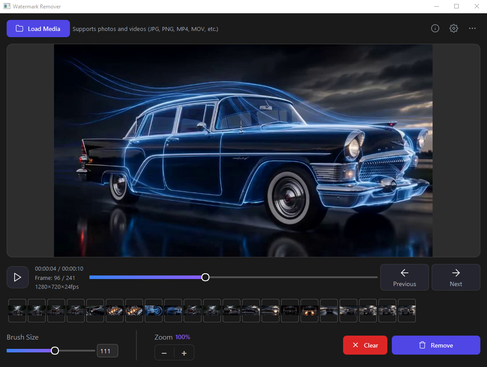

<div align="center">

# Watermark Remover Portable

**Портативная сборка для удаления водяных знаков и объектов с видо и фото под Windows. Установка в один клик, работа офлайн.**

[](https://github.com/vlad-ir/Watermark-Remover-Portable/stargazers)
[](LICENSE)
[](https://github.com/vlad-ir/Watermark-Remover-Portable/commits)
[](https://github.com/vlad-ir/Watermark-Remover-Portable/releases)



</div>

Watermark Remover — графическое приложение для удаления водяных знаков, логотипов и любых нежелательных объектов с видео и фотографий. Использует нейросеть **LaMa** (Large Mask Inpainting) для качественного восстановления фона, а при отсутствии модели — алгоритм OpenCV Telea.

## Возможности

- Удаление водяных знаков и объектов с **видео** (MP4, AVI, MOV, MKV и др.)
- Удаление объектов с **фотографий** (PNG, JPG, JPEG, BMP, TIFF, WEBP)
- Интеллектуальное восстановление фона на основе нейросети **LaMa**
- Ручное выделение области кистью и ластиком
- Поддержка **GPU** (NVIDIA CUDA) и **CPU**
- Работа с файлами, содержащими **русские буквы** в именах
- Портативность — все файлы в одной папке, ничего не устанавливается в систему
- Сохранение результата в исходном разрешении
- Тёмная тема интерфейса

## Системные требования

- Windows 10/11 (64-bit)
- NVIDIA GPU с поддержкой CUDA (рекомендуется для скорости обработки видео)
- Или CPU (медленнее, но работает)
- 4GB+ RAM
- 3GB свободного места на диске (включая модель ~200MB)

### Рекомендуемые видеокарты

| Серия | CUDA версия | Рекомендуется |
|-------|-------------|---------------|
| GTX 10xx (Pascal) | CUDA 11.8 | Да |
| RTX 20xx (Turing) | CUDA 11.8 | Да |
| RTX 30xx (Ampere) | CUDA 12.1 | Да |
| RTX 40xx (Ada Lovelace) | CUDA 12.1 | Да |
| RTX 50xx (Blackwell) | CUDA 12.1 | Да |

> **Примечание:** В комплекте устанавливается PyTorch 2.1.2+cu121, который корректно работает на системах с CUDA 12.1–12.8.

## Установка

### Быстрая установка (рекомендуется)

1. Скачайте архив `Watermark_Remover_Portable.zip` из [релизов](https://github.com/vlad-ir/Watermark-Remover-Portable/releases)
2. Распакуйте в любую папку в корне диска. Название папки латиницей, без пробелов (например `D:\WMRemover`)
3. Запустите `WatermarkRemover.bat`
4. Выберите пункт **2. Install / Re-install Watermark Remover**
5. Дождитесь завершения установки (скачивается Miniconda, PyTorch, модель LaMa)

### Установка из исходников

1. Клонируйте репозиторий: `git clone https://github.com/vlad-ir/Watermark-Remover-Portable.git`
2. Запустите `WatermarkRemover.bat`
3. Выберите пункт **2. Install / Re-install Watermark Remover**
4. Дождитесь завершения установки

Установщик автоматически скачает и настроит:
- Miniconda (портативный Python 3.10)
- PyTorch 2.1.2 с поддержкой CUDA 12.1
- UV package manager (ускоренная установка зависимостей)
- Модель LaMa (`big-lama.pt`, ~200MB)
- Все необходимые Python-библиотеки

## Запуск

1. Запустите `WatermarkRemover.bat`
2. Выберите пункт **1. Start GUI**
3. Приложение откроется в отдельном окне

## Использование

### Удаление водяного знака с видео

1. Нажмите **Load Video** и выберите видеофайл
2. На первом кадре **кистью** выделите водяной знак (красная область)
   - Настройте размер кисти ползунком **Brush**
   - Для исправления используйте **Eraser** (ластик)
3. Нажмите **Process All** — программа обработает все кадры видео
4. Сохраните результат через **Save**

### Удаление объектов с фотографии

1. Нажмите **Load Image** и выберите изображение
2. **Кистью** выделите объект, который нужно удалить
3. Нажмите **Process** (или **Process All**)
4. Сохраните результат через **Save** (PNG или JPG)

### Описание кнопок интерфейса

| Кнопка | Назначение |
|--------|------------|
| **Load Video** | Загрузить видеофайл |
| **Load Image** | Загрузить изображение |
| **Save Mask** | Сохранить текущую маску как PNG |
| **Process** | Обработать текущий кадр / изображение |
| **Process All** | Обработать все кадры видео (для фото — аналогично Process) |
| **Save** | Сохранить результат (видео — MP4, фото — PNG/JPG) |
| **<< Prev / Next >>** | Переключение кадров видео |
| **Brush / Eraser** | Режим рисования маски или стирания |
| **Brush (ползунок)** | Размер кисти (1–100 пикселей) |

### Горячие клавиши

- **Колёсико мыши** — изменение размера кисти
- **ЛКМ + движение** — рисование маски
- **Ctrl+C** в консоли — остановить приложение

## Работа без GUI (из скрипта)

Вы можете использовать модуль `inpainter` напрямую в своих Python-скриптах:

```python
from inpainter import load_model, inpaint_img_with_lama
import cv2
import numpy as np

# Загрузка модели
model = load_model("models/big-lama.pt", device="cuda")

# Загрузка изображения и маски
img = cv2.imread("photo.jpg")
img = cv2.cvtColor(img, cv2.COLOR_BGR2RGB)

mask = cv2.imread("mask.png", cv2.IMREAD_GRAYSCALE)

# Инпеинтинг
result = inpaint_img_with_lama(img, mask, model=model)

# Сохранение
cv2.imwrite("result.png", cv2.cvtColor(result, cv2.COLOR_RGB2BGR))
```
## Структура папок
```
Watermark-Remover-Portable/
├── WatermarkRemover.bat   # Главный файл запуска
├── src/
│   ├── main.py            # Интерфейс (tkinter)
│   ├── inpainter.py       # Модуль инпеинтинга (LaMa / OpenCV)
│   └── video_processor.py # Обработка видео
├── tools/                 # Портативные инструменты
│   ├── miniconda/         # Python окружение
│   └── uv.exe             # UV package manager
├── .venv/                 # Виртуальное окружение Python
├── models/                # Нейросетевые модели
│   └── big-lama.pt        # Модель LaMa
├── outputs/               # Сохранённые результаты
└── cache/                 # Кэш пакетов
```

## Изоляция

Приложение полностью изолировано и не создаёт файлы за пределами своей папки:
- Все модели в `models/`
- Все кэши в `cache/`
- Результаты в `outputs/`
- Системные переменные окружения не изменяются

## Решение проблем

### Ошибка "Inpainter not loaded"
- Убедитесь, что файл `models/big-lama.pt` существует
- Запустите установку повторно: `start.bat` → **2. Install / Re-install**

### Ошибка "NumPy" при запуске
- Запустите `WatermarkRemover.bat` → **3. Update Watermark Remover**
- Или переустановите полностью: **2. Install / Re-install**

### Видео не сохраняется / пустой файл
- Убедитесь, что на диске достаточно места
- Попробуйте сохранить в формате AVI вместо MP4

### Медленная обработка на CPU
- Обработка видео на CPU занимает значительно больше времени
- Рекомендуется использовать NVIDIA GPU

### Ошибка CUDA out of memory
- Закройте другие приложения, использующие GPU
- Уменьшите разрешение исходного видео
- Перезапустите приложение

## Лицензия

Данный проект распространяется под лицензией MIT.

## Авторы

- **NeiroVlad** ([github.com/vlad-ir](https://github.com/vlad-ir)) — автор портабельной сборки
- **oti.by** ([t.me/vlad_vlk](https://t.me/vlad_vlk)) — [oti.by](https://oti.by) — нейронные сети и умные чат-боты для бизнеса
- **Нейронки в бизнесе и в жизни** ([t.me/neiro_com](https://t.me/neiro_com)) — промпты, примеры, советы и т.д.

## Поддержать автора

Если проект оказался полезным, поставьте ⭐ на GitHub!

**Карта UnionPay:** `6229644000154242`

---

<div align="center">

**[⬆ Наверх](#watermark-remover-portable)**

</div>
